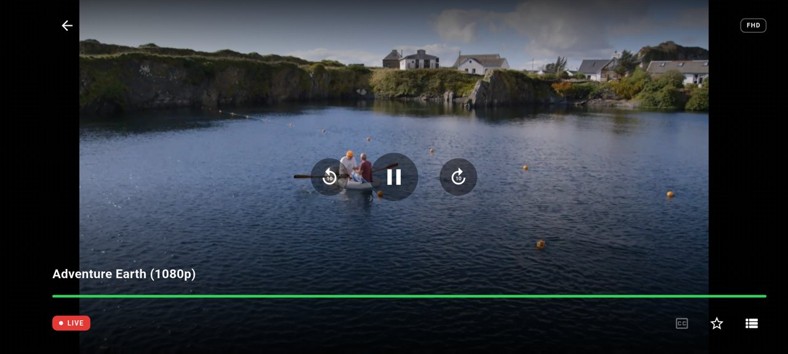
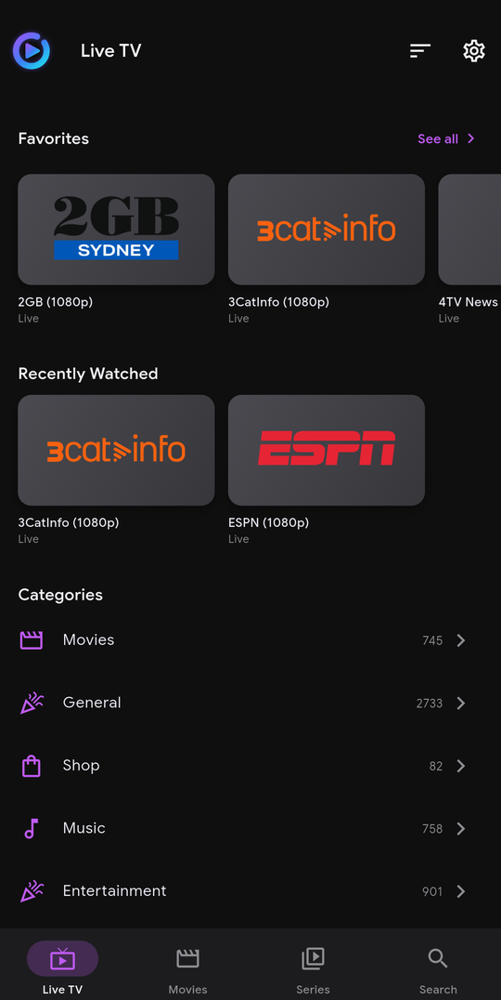
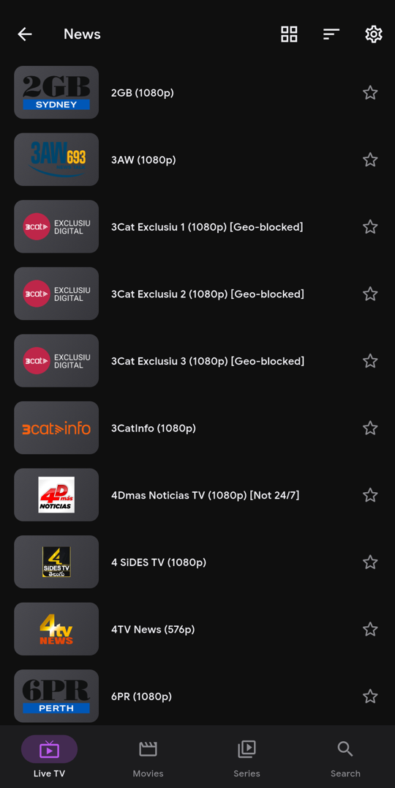
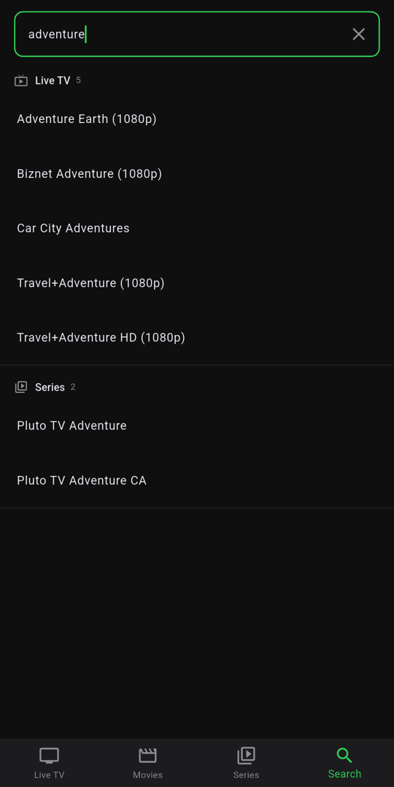
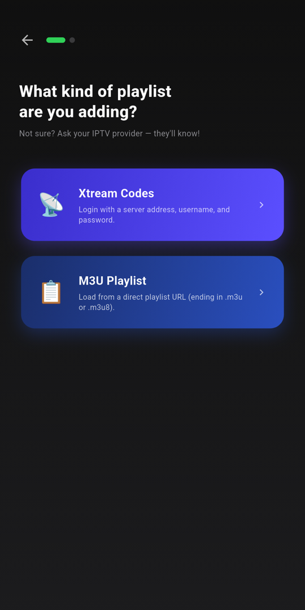
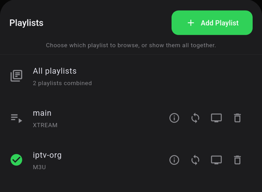

<p align="center"></p>

<h1 align="center">OpenIPTV</h1>

An open-source, ad-free, cross-platform IPTV client built in Flutter.

**Guiding principle:** If a non-technical user can't find their show in 3 taps, the UX has failed.

[](https://www.gnu.org/licenses/gpl-3.0)
[]()
[](https://github.com/Hunter-Clipper/OpenIPTV/releases/latest)

> **📺 Quick install on Fire TV / Android TV:** open the **Downloader** app and enter code **`2687835`**
> (or go to **[aftv.news/2687835](http://aftv.news/2687835)**).
> Direct APK: [app-release.apk](https://github.com/Hunter-Clipper/OpenIPTV/releases/latest/download/app-release.apk) · [All install options](#install)

---

## What it does

- Add an IPTV playlist via M3U URL, an M3U **file saved on your device**, or Xtream Codes credentials through a friendly setup wizard — no account required. Add more playlists any time from Settings, and browse one at a time or all together
- **Live TV** with channel categories — every channel shows its logo, what's on now (with time and progress) and what's next from the EPG (XMLTV), in a list or a grid of cards — plus Favorites / Recently Watched rows on the Live TV home
- **Clean names** — provider clutter like `|EN|`, `US|`, `A+ -` and ALL-CAPS is tidied for display ("|EN| HORROR/THRILLER" → "Horror / Thriller", "01 EN - Friday The 13th" → "01 Friday The 13th"); switch off in Settings → Appearance to see raw names
- **Genre icons** — categories and genres get a fitting icon automatically (sports and leagues, news, music, kids, movies, streaming services, networks and more), with a default for anything unrecognized
- **Per-channel TV guide** inside the player — see what's on now and next without leaving the channel. (The full-screen guide grid is switched off for now while it's being reworked.)
- **Catch-up / timeshift** on providers that support it — pause, rewind, and jump back to live
- **Movies and Series** home screens in the style of Google TV: a row of posters for every genre (first 20, then **See all**), plus Continue Watching and Favorites — or switch to a compact genre list from the top bar. Detail pages with full-width artwork, cast, runtime, More Like This, and season-by-season episodes with pictures and progress. Resume from where you left off
- **Player** inspired by YouTube TV: centered controls, clean progress bar, closed captions (CEA-608/708), original aspect ratio preserved (letterboxed, never stretched)
- Picture-in-Picture, a media notification with "now playing" info, and the screen stays awake during playback
- Fast global search across channels, movies, series, and what's airing now — results as rows of channel cards and posters, with your recent searches one tap away
- Multiple profiles per device — a "Who's watching?" screen with colourful round avatars, PIN lock, admin vs restricted roles. PINs (4–8 digits) are always typed on your device's own number keyboard
- **Parental controls**: auto-detects adult/XXX categories and PIN-protects them across Live TV, Movies, Series, and Search (without false alarms like "Adult Swim"). Kid profiles hide adult content entirely instead of just locking it
- **Role-based permissions**: only admin profiles can manage playlists, backup/restore, parental settings, and other profiles
- Background auto-refresh of playlists and EPG on a schedule you choose, with optional notifications
- Backup and restore your full setup (profiles, playlists, settings) as a single `.zip`, optionally password-protected — save it straight to Downloads (works on TVs), and restore it from the welcome screen on a fresh install
- **In-app updates** for sideloaded installs (Fire TV, Android TV boxes, phones without Google Play): OpenIPTV checks GitHub for new releases, shows what changed, and installs the update for you
- Material 3 design with Google Sans typography, a dark theme with 6 accent colors, smooth transitions, and Android-style grouped Settings; content sort toggle (provider order or A-Z)
- Works with a TV remote — full D-pad navigation with a clear white focus ring, a side navigation rail, and Android TV launcher support (tested on the Android TV emulator)
- No ads, no telemetry, no accounts

---

## Install

OpenIPTV is distributed as an APK from [GitHub Releases](https://github.com/Hunter-Clipper/OpenIPTV/releases/latest).

- **Fire TV / Android TV:** install the free **Downloader** app, enter code **`2687835`** (short link: [aftv.news/2687835](http://aftv.news/2687835)), and install. It points at the [latest APK](https://github.com/Hunter-Clipper/OpenIPTV/releases/latest/download/app-release.apk), so the code always installs the newest version. Allow Downloader to install unknown apps when asked.
- **Android phone / tablet:** download `app-release.apk` from the latest release and open it, allowing installs from your browser or file manager.
- **Updates:** from v0.10.48 on, the app offers new versions itself (Settings → About → Check for Updates, or automatically about once a day).

> Upgrading from **v0.10.45 or older**? Those builds were signed with a different key, so uninstall first: export a backup (Settings → Backup & Restore), uninstall, install the new version, then tap **Restore from a backup** on the welcome screen.

---

## Current status

| Phase | Target | Status |
|---|---|---|
| 1 | Android phone + tablet | ✅ Active development — [latest release](https://github.com/Hunter-Clipper/OpenIPTV/releases/latest) |
| 2 | Android TV | 🚧 In progress — D-pad navigation, TV nav rail, Leanback launcher |
| 3 | iOS + iPadOS | Not started |
| 4 | Apple TV | Not started |
| 5 | Windows + macOS | Not started |

### Roadmap — what's next

- UI to promote an existing profile to admin (currently the only admin account is the one created during first-run setup)
- Deep link support for advanced users (launch directly into a channel/movie/series or search from an external URL)
- Android TV polish — remote-first focus handling across every screen and text field
- iOS / iPadOS port (Phase 3)

---

## Screenshots

<p align="center">
  
</p>

<table>
  <tr>
    <td align="center"><br><sub>Live TV</sub></td>
    <td align="center"><br><sub>Channels</sub></td>
    <td align="center"><br><sub>Search</sub></td>
  </tr>
  <tr>
    <td align="center"><br><sub>Setup wizard</sub></td>
    <td align="center" colspan="2"><br><sub>Multiple playlists</sub></td>
  </tr>
</table>

<sub>Shown with the public <a href="https://github.com/iptv-org/iptv">iptv-org</a> playlist. OpenIPTV does not provide any content — bring your own playlist.</sub>

---

## Developer Setup

### Requirements

| Tool | Version |
|---|---|
| Flutter | 3.22+ (stable channel; developed on 3.44) |
| Dart | 3.4+ |
| Android SDK | minSdk 24 (Android 7.0), compile/target SDK 36 |
| Java | 17 (for Android Gradle) |

```bash
flutter doctor -v
```

### Clone and run

```bash
git clone https://github.com/Hunter-Clipper/OpenIPTV.git
cd OpenIPTV
flutter pub get
dart run build_runner build --delete-conflicting-outputs
flutter run -d <device-id>
```

`build_runner` generates Drift database code and Riverpod providers. Re-run it after changing any `@DriftDatabase`, `@DataClassName`, or `@riverpod` annotated class.

### Run tests

```bash
flutter test
flutter analyze
```

---

## Project Structure

```
lib/
├── core/
│   ├── models/         # Channel, Movie, Series, Episode, Programme, Profile, Source
│   ├── parsers/        # M3U, XMLTV, and Xtream Codes clients (no third-party parsers)
│   ├── providers/      # theme_providers (accent color, sort order, view modes), channel providers
│   ├── services/       # SourceManager, ProfileService, EpgService, PlaybackService,
│   │                   # NativeVideoPlayer, ParentalService, SearchService,
│   │                   # AutoRefreshService, NowPlayingService, PipService,
│   │                   # UpdateService
│   └── storage/        # database.dart (Drift/SQLite), preferences.dart, backup_manager.dart
│
├── features/
│   ├── updates/        # In-app update prompt and release-notes view
│   ├── live_tv/        # Channel list, categories, TV guide grid (disabled: kTvGuideEnabled), EPG panel, catch-up
│   ├── movies/         # Movie genre grid, movie detail
│   ├── series/         # Series genre grid, series detail (seasons, episodes)
│   ├── player/         # Full-screen player and controls overlay
│   ├── search/         # Global search (parental-filtered)
│   ├── onboarding/     # Setup wizard (first run, or add-playlist mode)
│   └── settings/       # Settings, profiles, profile picker, parental controls, backup
│
├── shared/
│   ├── theme/          # AppTheme (dark theme, accent swatches)
│   ├── utils/          # Formatting, friendly errors, genre icon matching
│   └── widgets/        # Poster/channel rails, settings cards, avatars, TV focus, native PIN field, …
│
└── app.dart            # App entry, routing, tab shell, native back handling

android/app/src/main/kotlin/com/openiptv/app/
                        # NativeVideoPlayer (ExoPlayer), MainActivity (PiP, back, keep-awake),
                        # AppUpdater (installs updates), FileSaver (Downloads)
```

---

## Architecture

**State management:** Riverpod 2 (`flutter_riverpod`). Providers are code-generated via `riverpod_annotation` + `riverpod_generator`. Accent color, sort order, and view mode are `StateProvider`s initialized from persisted preferences at startup. Theme is dark-only and not user-configurable.

**Database:** Drift (SQLite via `sqlite3_flutter_libs`). Schema is versioned with `schemaVersion` and guarded migrations (`PRAGMA table_info` checks before `addColumn`). All reads/writes are async.

**Navigation:** `go_router` with path-based deep linking.

**Video:** A custom native player built on AndroidX Media3 **ExoPlayer**, rendered into a Flutter `Texture` and driven over a method/event channel (`NativeVideoPlayer.kt` ↔ `native_video_player.dart`). Supports HLS, MPEG-TS, MP4/MKV, hardware decode, CEA-608/708 closed captions (multi-PMT TS extraction), audio/subtitle track selection, and resuming directly at a saved position. It replaced `media_kit`/libmpv in v0.10.3 for reliability on low-end Android TV hardware.

**Parsing:** Custom Dart M3U, XMLTV, and Xtream Codes parsers. No third-party parser dependencies. Large payloads are decoded off the UI thread.

**Background work:** `workmanager` schedules periodic playlist/EPG refresh; `flutter_local_notifications` reports results. `audio_service` provides the media notification.

**Updates:** `UpdateService` reads GitHub's `releases/latest` API (anonymous — no device or user data is sent), compares versions, downloads the APK into the app cache, and hands it to Android's package installer through a `FileProvider`. Play Store installs are skipped.

**Release signing:** release builds are signed with a dedicated key referenced by `android/key.properties` (git-ignored; never commit it or the keystore). Every release must use that same key, or Android will refuse to install it as an update. Without `key.properties`, release builds fall back to the debug key — fine for local testing, not for publishing.

**Responsive layout:** Grid column count is derived from screen width at runtime. On Android TV (detected natively via `UiModeManager`) the app switches to a side nav rail and remote-first focus handling.

---

## Key Rules

**No analytics or telemetry.** The app functions 100% offline except for fetching streams and playlist URLs.

**No accounts required.** Ever.

**F-Droid compatible target.** No proprietary dependencies in the main build.

**User-facing errors must be plain English.** Never expose stack traces, HTTP codes, or library error strings to the user.

**Performance floors:**
- Cold start to channel list: < 3 seconds
- Channel tap to video playing: < 2 seconds
- Search results: < 300ms post-debounce

---

## Contributing

1. Check the [open issues](https://github.com/Hunter-Clipper/OpenIPTV/issues)
2. Comment before starting to avoid duplication
3. Branch from `main` — `feature/<issue-number>-short-description`
4. Open a PR referencing the issue number

**Commit style:** Short imperative subject line, no trailing period.
```
fix: channel list respects sort toggle in category view
feat: accent color picker with 6 swatches
```

**PR checklist:**
- [ ] `flutter test` passes
- [ ] `flutter analyze` shows no issues
- [ ] No hardcoded user-facing strings outside the UI layer
- [ ] No new dependencies added without discussion in the issue first

---

## License

GPL-3.0 — see [LICENSE](./LICENSE).

Contributions are welcome under the same license.
