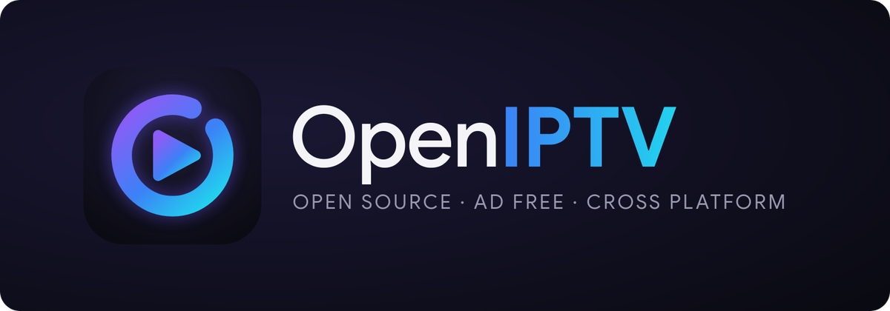
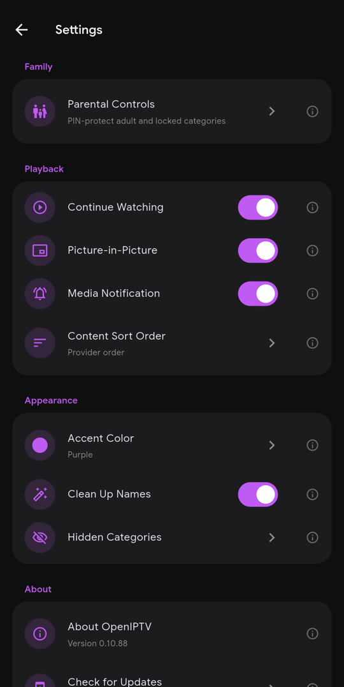
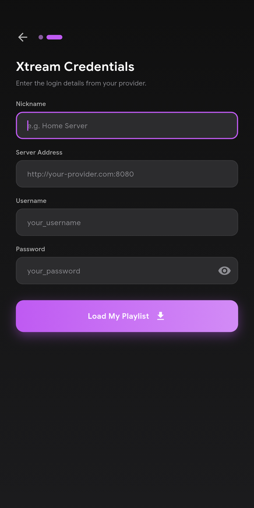
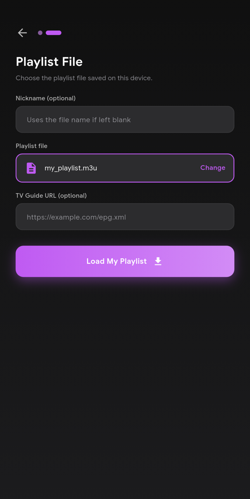
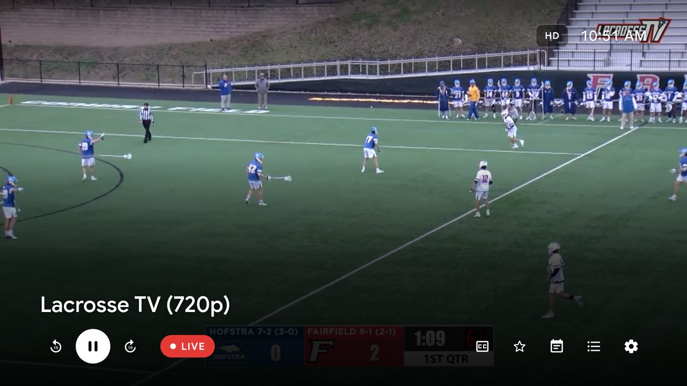
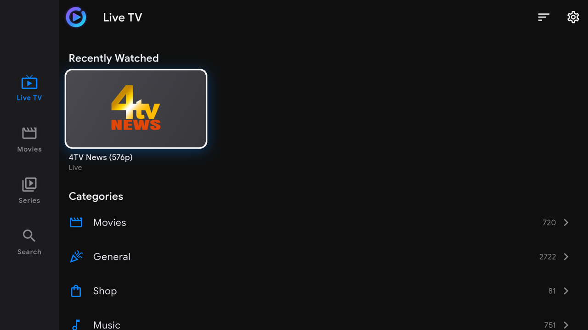
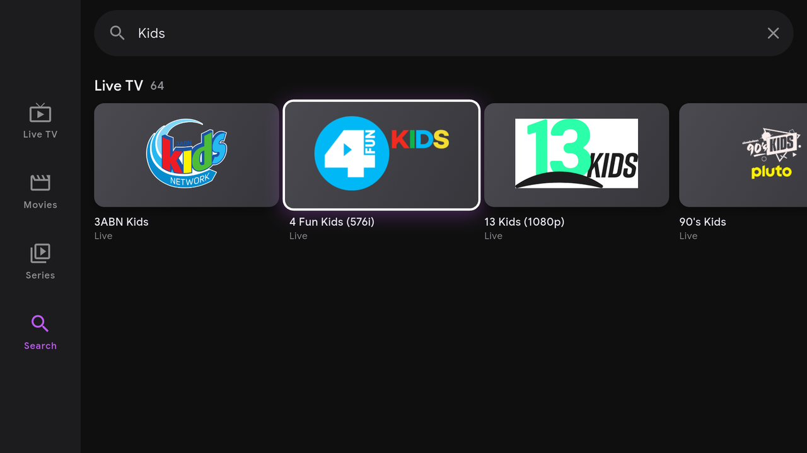

<p align="center">
  
</p>

<p align="center">
  A clean, fast media player for the IPTV playlists <b>you already have</b>. Built in Flutter.<br>
  <sub>If a non-technical user can't find their show in 3 taps, the UX has failed.</sub>
</p>

<p align="center">
  <a href="https://github.com/Hunter-Clipper/OpenIPTV/releases/latest"></a>
  <a href="https://www.gnu.org/licenses/gpl-3.0"></a>
  
</p>

> [!IMPORTANT]
> **OpenIPTV is only a player. It does not include, host, sell or link to any channels, streams or playlists.**
> You add your own M3U playlist, playlist file or Xtream Codes login from a service you are entitled to use.
> We don't provide playlists and won't give advice on where to get them. Please make sure you have the
> right to watch anything you open in the app. The only playlist this project mentions is the public,
> community-maintained [iptv-org/iptv](https://github.com/iptv-org/iptv) repository, which lists freely
> available channels and is used for our screenshots.

---

## Install

> **📺 Fire TV / Android TV:** open the **Downloader** app and enter code **`2687835`**
> (or go to **[aftv.news/2687835](http://aftv.news/2687835)**). It always installs the latest version.

- **Android phone / tablet:** download [`app-release.apk`](https://github.com/Hunter-Clipper/OpenIPTV/releases/latest/download/app-release.apk) from the [latest release](https://github.com/Hunter-Clipper/OpenIPTV/releases/latest) and open it, allowing installs from your browser or file manager.
- **Fire TV / Android TV:** install the free Downloader app, enter the code above, and allow it to install unknown apps when asked.
- **Updates:** the app offers new versions itself (automatically every time it starts, or Settings → About → Check for Updates).

> Upgrading from **v0.10.45 or older**? Those builds were signed with a different key, so uninstall first:
> export a backup (Settings → Backup & Restore), uninstall, install the new version, then tap
> **Restore from a backup** on the welcome screen.

---

## Screenshots

<p align="center">
  
</p>

<table>
  <tr>
    <td align="center"><br><sub>Live TV</sub></td>
    <td align="center"><br><sub>Channels</sub></td>
    <td align="center"><br><sub>Settings</sub></td>
  </tr>
  <tr>
    <td align="center"><br><sub>Add a playlist</sub></td>
    <td align="center"><br><sub>Xtream login</sub></td>
    <td align="center"><br><sub>From a file</sub></td>
  </tr>
</table>

<p align="center">
  <br>
  
  <br>
  <sub>On Android TV and Fire TV</sub>
</p>

<sub>Shown with the public <a href="https://github.com/iptv-org/iptv">iptv-org</a> playlist. OpenIPTV provides no content of its own.</sub>

---

## What it does

**Bring your own playlist**
- Add an **M3U link**, an **M3U file saved on your device**, or an **Xtream Codes** login in a friendly setup wizard. No account needed.
- Add as many playlists as you like and browse one at a time or all together.
- **Edit a playlist** when your provider changes its server address or your login — the new details are checked before they're saved, and your favourites and watch progress carry over.
- **Refresh everything with one tap** — every playlist's channels, movies, series and TV guide — or set it to happen in the background.
- Your logins are **stored encrypted** on the device, with a key only the app can use.

**Watch**
- **Live TV** with categories, channel logos, and what's on now and next (with time and progress) from your playlist's TV guide (XMLTV). Favorites and Recently Watched rows on the Live TV home.
- **Movies and Series** with a row of posters for every genre, Continue Watching and Favorites, or a compact genre list. Detail pages with full-width artwork, cast, runtime, More Like This, and season-by-season episodes with pictures and progress.
- **The player**, inspired by top apps and styled like the rest of the app: centred controls with your accent colour on phones and a slim bar along the bottom on TV, a Material 3 seek bar, what's on now and next, and a **playback settings** sheet for subtitles, audio track, picture fit (Fit, Zoom, Fill screen — never stretched) and speed. On Live TV, a **channel list** slides in (swipe left, press Right on a remote, or tap the list button) so you can switch without leaving the player. Closed captions (CEA-608/708), catch-up on providers that support it, Picture-in-Picture and a Now Playing notification.
- **Search** across channels, movies, series and what's on right now, with recent searches one tap away.
- **Cast to your TV** from your phone: send a channel, movie or episode to a Chromecast or Google TV and keep using the phone as the remote (play, pause, seek, switch channels, volume). Your place in movies and episodes is saved while you cast.

**For the whole household**
- Profiles with a "Who's watching?" screen, optional PINs (typed on your device's own number keyboard) and admin/standard roles.
- **Parental controls** that lock adult categories behind the admin PIN everywhere (without false alarms like "Adult Swim"). Kids profiles hide adult content entirely.
- **Backup & Restore** of profiles, playlists and settings as one `.zip`, optionally password-protected.

**Polish**
- Tidy names (`|EN| HORROR/THRILLER` → "Horror / Thriller") and a fitting icon for every category.
- Material 3 design with Google Sans, six accent colours and Android-style grouped Settings.
- Works with a TV remote: a side navigation rail, a clear white focus ring, the TV's own on-screen keyboard for search, logins and PINs, and Android TV launcher support.
- Background refresh of playlists and guides on a schedule you choose.
- **In-app updates** for sideloaded installs.
- **No ads, no telemetry, no accounts.**

---

## Current status

| Phase | Target | Status |
|---|---|---|
| 1 | Android phone + tablet | ✅ Beta — [latest release](https://github.com/Hunter-Clipper/OpenIPTV/releases/latest) |
| 2 | Android TV / Fire TV | ✅ Beta — [latest release](https://github.com/Hunter-Clipper/OpenIPTV/releases/latest) (tested on a Chromecast with Google TV) |
| 3 | iOS + iPadOS | Not started |
| 4 | Apple TV | Not started |
| 5 | Windows + macOS | Not started |

**Next up:** promoting a profile to admin, deep links, a reworked full-screen TV guide, and the iOS port.

---

## Developer setup

| Tool | Version |
|---|---|
| Flutter | 3.22+ (stable; developed on 3.44) |
| Dart | 3.4+ |
| Android SDK | minSdk 24 (Android 7.0), compile/target SDK 36 |
| Java | 17 (for Android Gradle) |

```bash
git clone https://github.com/Hunter-Clipper/OpenIPTV.git
cd OpenIPTV
flutter pub get
dart run build_runner build --delete-conflicting-outputs
flutter run -d <device-id>
```

`build_runner` generates the Drift database code and Riverpod providers; re-run it after changing any `@DriftDatabase`, `@DataClassName` or `@riverpod` class.

```bash
flutter analyze
flutter test
```

### Project structure

```
lib/
├── core/
│   ├── models/      # Channel, Movie, Series, Episode, Programme, Profile, Source, ContentDetails
│   ├── parsers/     # M3U, XMLTV and Xtream Codes clients (no third-party parsers)
│   ├── providers/   # accent colour, sort order, view modes, home layouts, channels
│   ├── services/    # SourceManager, ProfileService, EpgService, PlaybackService, NativeVideoPlayer,
│   │                # ParentalService, SearchService, AutoRefreshService, UpdateService, …
│   └── storage/     # Drift database, preferences, backups, local playlist files
├── features/        # live_tv, movies, series, player, search, onboarding, settings, updates
├── shared/          # theme, utils (names, formatting, errors, genre icons) and shared widgets
└── app.dart         # routing, tab shell / TV rail, native back handling

assets/branding/     # logo, splash, TV banner and README banner sources (SVG) + export.py
android/app/src/main/kotlin/com/openiptv/app/
                     # NativeVideoPlayer (ExoPlayer), CastController, MainActivity, AppUpdater, FileSaver
```

### Architecture

- **State:** Riverpod 2, partly code-generated with `riverpod_annotation`.
- **Database:** Drift on SQLCipher (AES-256, key kept in the Android Keystore via `flutter_secure_storage`), with versioned, guarded migrations.
- **Navigation:** `go_router`. On Android TV (detected natively via `UiModeManager`) the tab bar becomes a side rail with remote-first focus handling.
- **Video:** a custom native player on AndroidX Media3 **ExoPlayer**, rendered into a Flutter `Texture` (a `SurfaceTexture`, so decoder crop is honoured). It handles HLS, MPEG-TS, MP4/MKV, hardware decoding, CEA-608/708 captions and audio/subtitle track selection.
- **Parsing:** custom Dart M3U, XMLTV and Xtream parsers; large payloads are decoded off the UI thread.
- **Casting:** the Google Cast framework with the Default Media Receiver (no custom receiver app); phones only — it is switched off on TVs.
- **Background work:** `workmanager` for scheduled refresh, `flutter_local_notifications` for results, `audio_service` for the media notification.
- **Updates:** reads GitHub's `releases/latest` API anonymously, downloads the APK and hands it to Android's installer. Play Store installs are skipped.
- **Branding:** edit the SVGs in `assets/branding/`, then run `python3 assets/branding/export.py`, `dart run flutter_launcher_icons` and `dart run flutter_native_splash:create`.
- **Release signing:** release builds are signed with a dedicated key referenced by the git-ignored `android/key.properties`. Every release must use the same key or Android refuses the update.

### Project rules

- **No content.** The app ships with no channels, playlists or stream sources, and the project won't add any or document where to find them.
- **No analytics, telemetry or accounts.** The app only contacts the playlists and guides you add, plus GitHub for update checks.
- **Plain-English errors.** Never show stack traces, HTTP codes or library error strings to users.
- **F-Droid-friendly:** no proprietary dependencies in the main build.
- **Performance targets:** cold start to channel list under 3 s, channel tap to video under 2 s, search results under 300 ms.

---

## Contributing

1. Check the [open issues](https://github.com/Hunter-Clipper/OpenIPTV/issues) and comment before starting.
2. Branch from `main` (`feature/<issue-number>-short-description`) and open a PR referencing the issue.
3. Use short imperative commit subjects: `fix: channel list respects sort toggle`.

Before opening a PR: `flutter analyze` is clean, `flutter test` passes, and no new dependencies without discussion first.

Please don't open issues or PRs asking for, sharing or linking to playlists or streams. They will be closed.

---

## License

GPL-3.0 — see [LICENSE](./LICENSE). Contributions are welcome under the same license.
Google Sans is used under the SIL Open Font License (`assets/fonts/google_sans/OFL.txt`).
